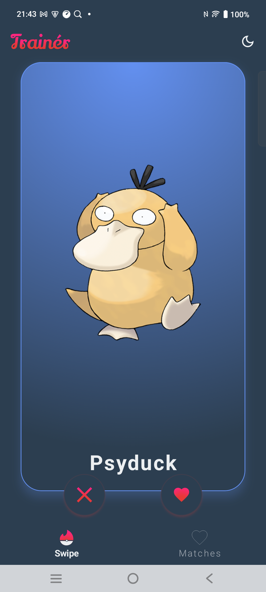
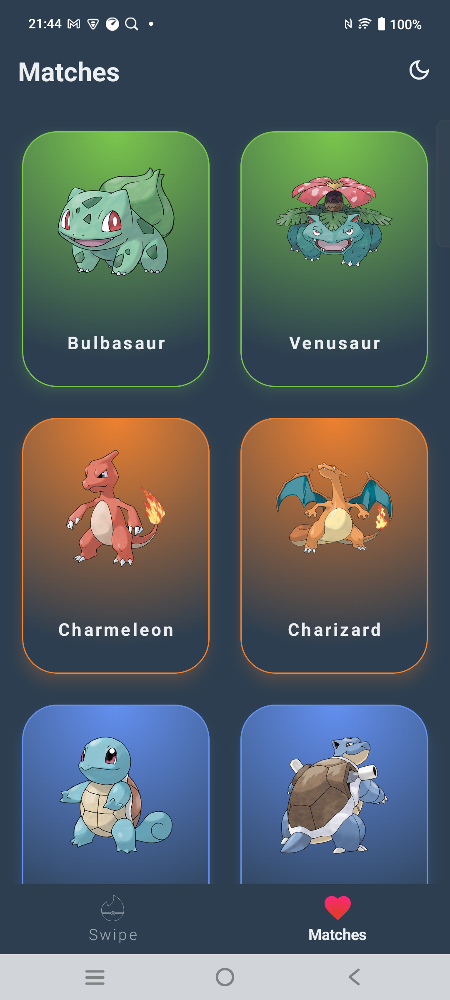
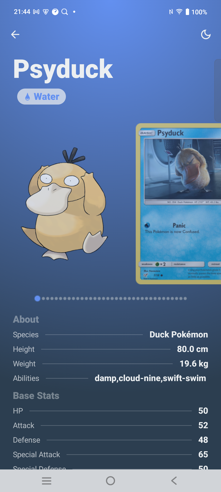
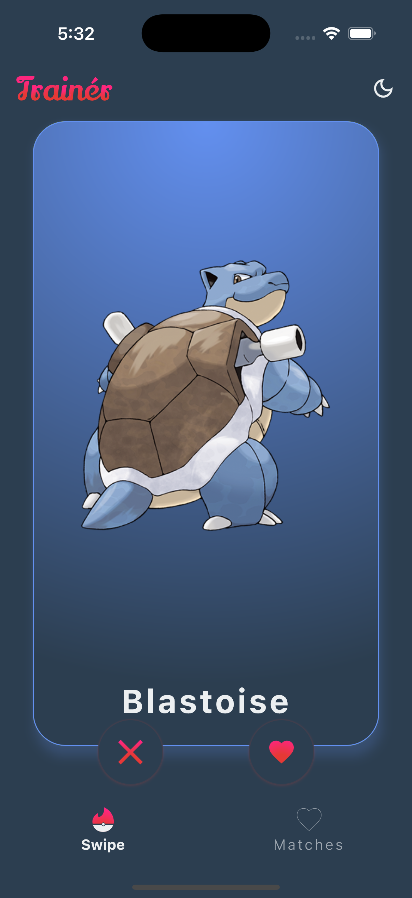
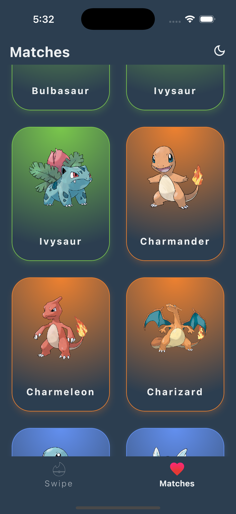
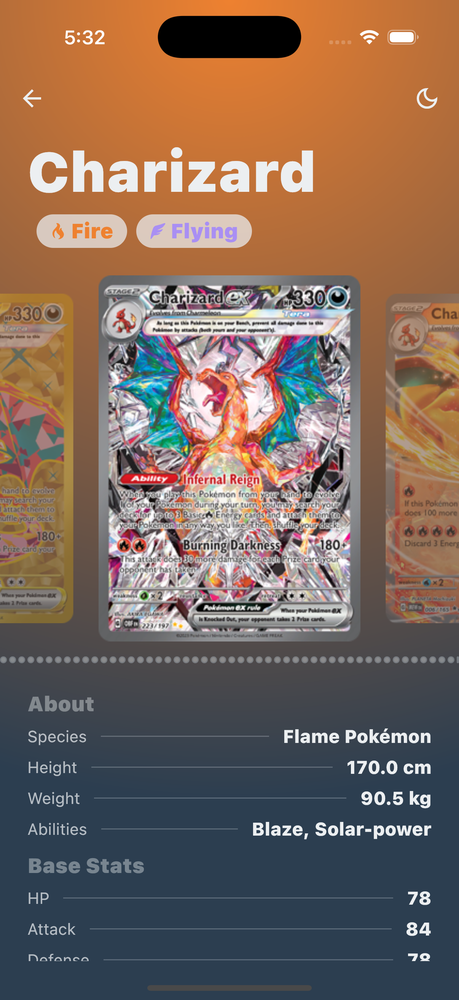

#  Trainér
<hr/>
This is a Kotlin Multiplatform project targeting Android, iOS.
<hr/>
Trainér is the dating app for Pokemon enthusiasts! Discover and connect with Pokemon in your area. Swipe right on those you're attracted to and left on those you're not. With Trainér, you'll never have to catch 'em all alone again!

* `/composeApp` is for code that will be shared across your Compose Multiplatform applications.
  It contains several subfolders:
    - `commonMain` is for code that’s common for all targets.
    - Other folders are for Kotlin code that will be compiled for only the platform indicated in the folder name.
      For example, if you want to use Apple’s CoreCrypto for the iOS part of your Kotlin app,
      `iosMain` would be the right folder for such calls.

* `/iosApp` contains iOS applications. Even if you’re sharing your UI with Compose Multiplatform,
  you need this entry point for your iOS app. This is also where you should add SwiftUI code for your project.


Learn more about [Kotlin Multiplatform](https://www.jetbrains.com/help/kotlin-multiplatform-dev/get-started.html)…

## Screen Shots
### Android
| Home                                                     | Matches                                                     | Detail                                                     |
|----------------------------------------------------------|-------------------------------------------------------------|------------------------------------------------------------|
|  |  |  |

### iOS
| Home                                                 | Matches                                                 | Detail                                                 |
|------------------------------------------------------|---------------------------------------------------------|--------------------------------------------------------|
|  |  |  |

## Libraries Used
### AndroidX
- [Activity Compose](https://mvnrepository.com/artifact/androidx.activity/activity-compose)
- [Navigation Compose](https://mvnrepository.com/artifact/androidx.navigation/navigation-compose)
- [Lifecycle Runtime Compose](https://mvnrepository.com/artifact/androidx.lifecycle/lifecycle-runtime-compose)
- [Lifecycle ViewModel](https://mvnrepository.com/artifact/androidx.lifecycle/lifecycle-viewmodel)

### Test
- [Kotlin Test](https://mvnrepository.com/artifact/org.jetbrains.kotlin/kotlin-test)
- [Kotlin Test Annotations](https://mvnrepository.com/artifact/org.jetbrains.kotlin/kotlin-test-annotations-common)
- [Kotlinx Coroutines Test](https://mvnrepository.com/artifact/org.jetbrains.kotlinx/kotlinx-coroutines-test)
- [Mockmp](https://github.com/kosi-libs/MocKMP)
- [Kover Test Coverage](https://github.com/Kotlin/kotlinx-kover)

### Kotlinx
- [Kotlinx Coroutines Core](https://mvnrepository.com/artifact/org.jetbrains.kotlinx/kotlinx-coroutines-core)
- [Kotlinx Serialization JSON](https://mvnrepository.com/artifact/org.jetbrains.kotlinx/kotlinx-serialization-json)

### Koin
- [Koin BOM](https://mvnrepository.com/artifact/io.insert-koin/koin-bom)
- [Koin Core](https://mvnrepository.com/artifact/io.insert-koin/koin-core)
- [Koin Core Coroutines](https://mvnrepository.com/artifact/io.insert-koin/koin-core-coroutines)
- [Koin Android](https://mvnrepository.com/artifact/io.insert-koin/koin-android)
- [Koin Compose](https://mvnrepository.com/artifact/io.insert-koin/koin-compose)
- [Koin Compose ViewModel](https://mvnrepository.com/artifact/io.insert-koin/koin-compose-viewmodel)

### Ktor
- [Ktor Client CIO](https://mvnrepository.com/artifact/io.ktor/ktor-client-cio)
- [Ktor Client Core](https://mvnrepository.com/artifact/io.ktor/ktor-client-core)
- [Ktor Client Darwin](https://mvnrepository.com/artifact/io.ktor/ktor-client-darwin)
- [Ktor Client Logging](https://mvnrepository.com/artifact/io.ktor/ktor-client-logging)
- [Ktor Client Content Negotiation](https://mvnrepository.com/artifact/io.ktor/ktor-client-content-negotiation)
- [Ktor Serialization Kotlinx JSON](https://mvnrepository.com/artifact/io.ktor/ktor-serialization-kotlinx-json)

### SQLDelight
- [Room Compiler](https://mvnrepository.com/artifact/androidx.room/room-compiler)
- [Room Runtime](https://mvnrepository.com/artifact/androidx.room/room-runtime)
- [SQLite Bundled](https://mvnrepository.com/artifact/androidx.sqlite/sqlite-bundled)

### Coil
- [Coil Compose](https://mvnrepository.com/artifact/io.coil-kt/coil-compose)
- [Coil Network Ktor](https://mvnrepository.com/artifact/io.coil-kt.coil3/coil-network-ktor3)

## Prerequisites
- [Android Studio](https://developer.android.com/studio) or [IntelliJ IDEA](https://www.jetbrains.com/idea/)
- [Android SDK](https://developer.android.com/studio)
- [Xcode](https://developer.apple.com/xcode/)

## Getting Started
1. Clone the repository
2. Open the project in Android Studio or IntelliJ IDEA.
3. Open the terminal and run the following command to build the project:
   ```bash
   ./gradlew build
   ```
4. To run the Android app, open the `composeApp` module in Android Studio and click on the "Run" button.
5. To run the iOS app, open the `iosApp` module in Xcode and click on the "Run" button.
6. To run the iOS app on a simulator, make sure you have the latest version of Xcode installed and select a simulator from the list of available devices.
7. To run the iOS app on a physical device, make sure you have a valid Apple Developer account and follow the instructions in Xcode to set up code signing and provisioning profiles.
